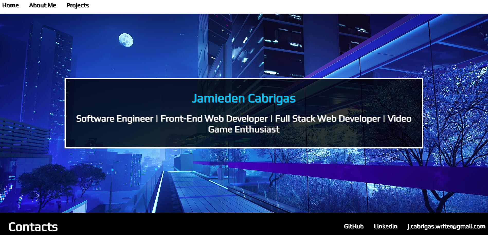
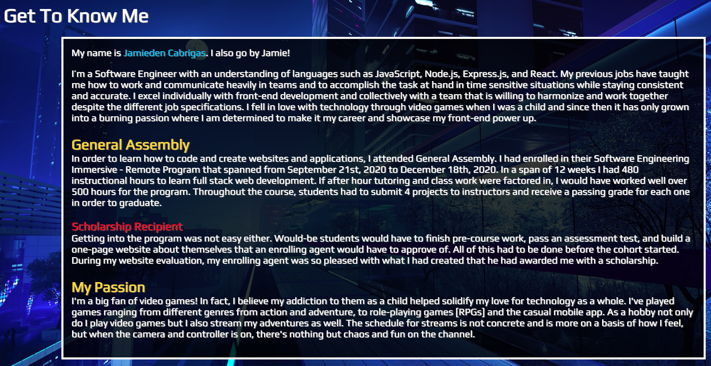
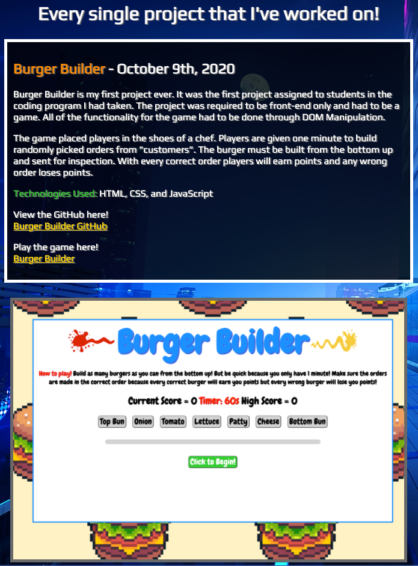

# Portfolio

Welcome to my portfolio's README. If you wanted to know how the code to my portfolio looks, then feel free to browse around. You'll be able to see the different EJS files in my views folder, my JS file, and the basic files in my public folder. I encourage you to look around!

## Live Website

Now that you've seen the code, let's say you wanted to look at the website itself! You can access my live domain here!

www.justjeo.com

If you still plan on looking around and would like to take a small sneak peak of my portfolio before heading over I have some screenshots for you.

### Home Page

The landing page of my portfolio greets visitors with some simple info about me. It lets everyone know my full first and last name along with what I self identify as in the tech industry

### About Me

Clicking on the "About Me" link in the navigation bar at the top of the page will take visitors to an informational page. This is where I describe my journey to becoming a Software Engineer

I've provided a list of technologies that I have learned from General Assembly's program. I wanted to make it easy and straight to the point for everyone to see and understand what I'm skills I am able to provide.

### Projects

My "Projects" page has a complete list of every single project that I've worked on. So far all of my projects have been for my Software Engineering program, but I am currently working on personal projects in my free time so I can add more to this list. They are arranged from the oldest to the most recent day of creation.

## Responsive Site

In the modern world, websites can be accessed on many different devices such as a computer, tablet, and even phone. Each of these devices have varying screen sizes. That can be tough on a website that isn't sized properly. Have you ever tried looking at a website on your phone that can only be properly viewed on a desktop? Parts of the page can be squished on top of each other or even cut off from the the visitor's view entirely. With my portfolio I made sure to have it viewable on all screen sizes for any device. Try it yourself!